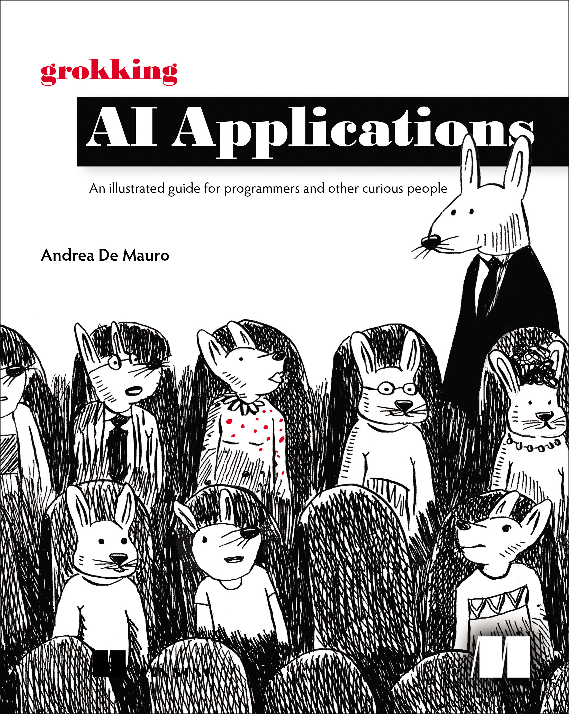

## GenAI Appendix Scripts

<table>
  <tr>
    <td>
      This repository mirrors the Python appendix material from <em>Grokking AI Applications</em> by Andrea De Mauro (MEAP, ISBN 9781633435872, publication ETA Spring 2026). Each script recreates the Langflow build featured in the matching chapter so you can inspect the raw LangChain wiring, extend it, or plug it into your own stack. Grab the full book at <a href="https://www.manning.com/books/grokking-ai-applications?a_aid=demauro&amp;chan=mm_github">manning.com/books/grokking-ai-applications</a>.
    </td>
    <td valign="top">
      
    </td>
  </tr>
</table>

### Get the code

Clone the repository from GitHub:

```bash
git clone https://github.com/laibniz/GrokkingAIapplications.git
cd GrokkingAIapplications
```

### Configure API keys

Create a `.env` file in the project root and add any credentials the chapters call for:

```
OPENAI_API_KEY=sk-...
SERP_API_KEY=...
COMPOSIO_API_KEY=...
```

You can use the existing `.env.example` as a base. Just rename it to `.env` and change the keys inside.
Each script loads `.env` automatically, so there is no need to export the variables manually.

### Install dependencies

Use Python 3.10+ and install the packages referenced at the top of each script. For example, the Chapter 2 chatbot only needs:

```bash
pip install langchain-openai langchain-core python-dotenv
```

Later chapters introduce extras such as FAISS, FastAPI, Composio, or FastMCP; the exact `pip install ...` commands are embedded in every file’s docstring.

### Run a script

From the repository root:

```bash
python CH2-HelloWorld.py
```

The naming convention follows the book (`CH3-*.py`, `CH4-*.py`, etc.) so you can jump directly to the Python version of any Langflow build.

### Need context?

Read [SCRIPT_GUIDE.md](SCRIPT_GUIDE.md) for a chapter-by-chapter walkthrough that explains how each file corresponds to the “What if we coded this?” sections in the book.
